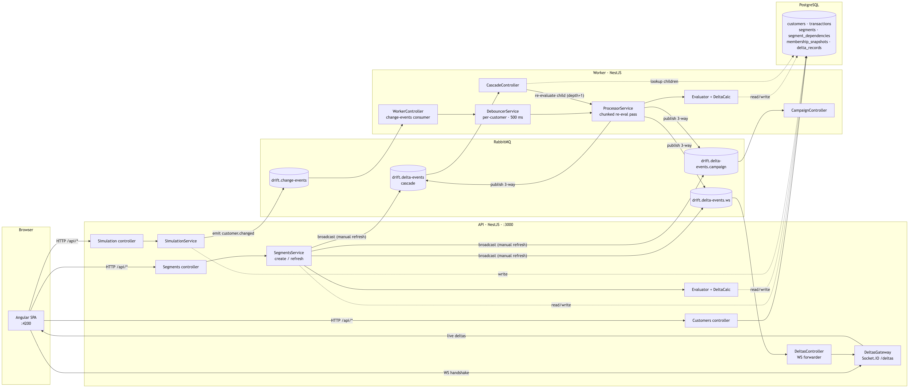
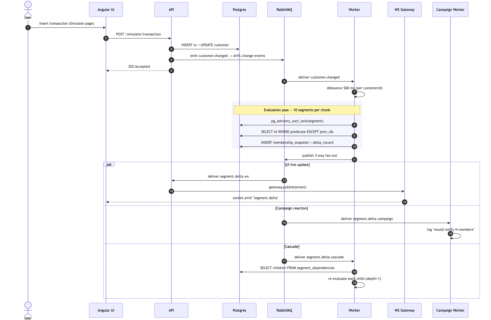

# Drift Happens

Customer Data Platform-ის სტილში აწყობილი სეგმენტების მართვის სისტემა.
კლიენტები სეგმენტებში ხვდებიან წესების მიხედვით; **წესები არ იცვლება, მაგრამ
სეგმენტში შემავალი კლიენტების სიმრავლე იცვლება**. დაინტერესებულ მხარეებს
(UI, კამპანიები, დამოკიდებული სეგმენტები) სჭირდებათ ინფორმაცია არა მხოლოდ
„შეიცვალა თუ არა", არამედ **კონკრეტულად ვინ დაემატა და ვინ გამოაკლდა**.

ეს რეპოზიტორია არის Optio-ს Middle Software Engineer პოზიციის სატესტო
დავალება.

---

## რას აკეთებს, მარტივი ენით

- **დინამიური სეგმენტები** რეაგირებენ მონაცემების ცვლილებაზე. როცა
  კლიენტი ახორციელებს ტრანზაქციას, ცვლის პროფილის ველს, გამოდის
  დროის ფანჯრიდან, ან ცვლილება ხდება მშობელ სეგმენტში — ხდება
  დინამიური სეგმენტების ხელახალი დათვლა და delta-ს გამოთვლა (`added[]` /
  `removed[]`) წინა snapshot-თან მიმართებაში.
- **სტატიკური სეგმენტები** (მაგ. „მარტის კამპანიის აუდიტორია")
  ფიქსირდება შექმნისას და გადაითვლება მხოლოდ
  `POST /segments/:id/refresh`-ის გამოძახებისას. მონაცემების
  ცვლილება მათ არ ცვლის.
- **Delta-ები, არა boolean-ები.** ყოველი ხელახალი შეფასება აწარმოებს
  კონკრეტული კლიენტების ID-ების სიას — ვინ შემოვიდა და ვინ გავიდა
  — რომელიც ინახება `delta_records` ცხრილში აუდიტისთვის და
  ვრცელდება სამ დამოუკიდებელ subscriber-ზე.
- **კასკადი.** სეგმენტები შეიძლება გამოიყენებოდეს სხვა სეგმენტის
  ფილტრად (`is_member_of: <id>`). მშობლის შემადგენლობის ცვლილება
  იწვევს ყველა შვილის რეკურსიულ გადათვლას. ციკლები იბლოკება სეგმენტის
  შექმნისას; runtime-ზე სიღრმე 5-ის შემდეგ აფიქსირებს warning-ს და
  10-ზე იჭრება.
- **მაღალი დატვირთვის დარეგულირება.** Per-customer
  debouncing აერთიანებს ერთი კლიენტის ცვლილებების სერიას ერთ
  გადათვლაში; chunked processing არ აძლევს 50K კლიენტის ერთდროულ
  იმპორტს worker-ის დაბლოკვის საშუალებას.
- **Idempotency.** იგივე ცვლილების ივენთი ხელახლა მიღებისას
  წარმოშობს ცარიელ delta-ს და ჩერდება fan-out-ამდე. ერთი და იმავე
  სეგმენტის პარალელური გადათვლები სერიალიზდება Postgres-ის
  advisory lock-ით.

---

## არქიტექტურა

### კომპონენტები და მათი კავშირები



### სიგნალის გზა: კლიენტის ერთი ცვლილება



დიზაინის მიხედვით, სისტემის არქიტექტურა event-driven-ზეა დაფუძნებული.
რიგი producer-ებსა და evaluator-ს შორის არის ის ადგილი, სადაც debouncing
აერთიანებს მცირე ცვლილებების სერიებს და chunked processing უზრუნველყოფს
მძიმე სამუშაოების გონივრულ დანაწილებას. სამი subscriber იღებს ყოველ delta-ს
დამოუკიდებლად — არცერთი არ ბლოკავს მეორეს, ხოლო მეოთხე subscriber-ის
დამატება ნიშნავს მხოლოდ ერთ ახალ რიგზე გამოწერას.

---

## გაშვება

### წინაპირობა

- Docker Desktop (ან Docker Engine) Docker Compose v2-ით

საკმარისია სისტემის გასაშვებად. დანარჩენი — Node, Postgres, RabbitMQ — ეშვება
კონტეინერებში.

### სტეკის გაშვება

```bash
docker compose up --build
```

სერვისები:

| სერვისი    | პორტი           | აღწერა                                           |
| ---------- | --------------- | ------------------------------------------------ |
| `client`   | `4200`          | Angular SPA, რომელსაც ემსახურება nginx; პროქსირებს `/api`-სა და `/socket.io`-ს API-ზე |
| `api`      | `3000`          | NestJS REST + Socket.IO gateway                  |
| `worker`   | —               | NestJS RabbitMQ consumer (HTTP-ის გარეშე)        |
| `postgres` | `5432`          | user/pass/db: `drift`/`drift`/`drift`            |
| `rabbitmq` | `5672`, `15672` | management UI: <http://localhost:15672> (`guest` / `guest`) |

API იყენებს TypeORM-ის `synchronize: true`-ს გაშვებისას, ასე რომ
მონაცემთა ბაზის სქემა იქმნება ავტომატურად პირველი გაშვებისას.

### საწყისი მონაცემები (seed)

Seed იწმენდს ცხრილებს და ხელახლა ავსებს: 10 კლიენტი (რეალისტური
ტრანზაქციების ისტორიით) და 6 სეგმენტი, შექმნილი
`SegmentsService.create`-ის გამოყენებით — ანუ გადის ვალიდაციის
სრული გზა (parents-exist შემოწმება, ციკლის DFS, dependency-ების
ჩაწერა).

```bash
docker compose exec api npm run seed
```

რას მიიღებთ:

| სეგმენტი                 | ტიპი    | წესი                                                              |
| ------------------------ | ------- | ----------------------------------------------------------------- |
| Active buyers            | dynamic | ბოლო 30 დღეში მინიმუმ 1 ტრანზაქცია                                |
| VIP customers            | dynamic | ბოლო 60 დღეში ტრანზაქციების ჯამი > 5000                           |
| Risk group               | dynamic | tx_count ≥ 1, მაგრამ ბოლო 90 დღეში 0 ტრანზაქცია                   |
| **VIP and active**       | dynamic | `is_member_of(VIP) AND is_member_of(Active)` — **დონე-1 კასკადი** |
| **Top-tier loyalists**   | dynamic | `is_member_of(VIP and active) AND balance > 10000` — **დონე-2**   |
| March campaign audience  | static  | tx_count ≥ 1 — ფიქსირდება შექმნისას                               |

ეს გვაძლევს 3-დონიან კასკადს:
`Active / VIP → VIP and active → Top-tier loyalists`.

### UI-ს გახსნა

<http://localhost:4200>

სამი გვერდი: **Segments** — სეგმენტების სია (delta-ს მიღებისას
ანათებს live), **Segment detail** — კონკრეტული სეგმენტის წევრები,
ბოლო delta-ები, ხელით განახლება, **Simulate** — ტრანზაქცია /
პროფილის პატჩი / დროის წინ წაწევა / bulk ტრანზაქციები.

### გამორთვა

```bash
docker compose down       # გაჩერება, DB volume-ის შენარჩუნებით
docker compose down -v    # გაჩერება და Postgres მონაცემების წაშლა
```

---

## დემო სცენარი

ყველაფრის დემონსტრაციის ყველაზე სწრაფი გზა:

1. `docker compose up --build` — დაელოდეთ "API listening" / "Worker
   consuming queues" ლოგებს.
2. `docker compose exec api npm run seed`.
3. გახსენით <http://localhost:4200>. ჩამოთვლილია 6 სეგმენტი.
4. გახსენით **Simulate** გვერდი. სხვა ტაბში გახსენით **Segment
   detail** "Active buyers"-ისთვის და "Top-tier loyalists"-ისთვის,
   რომ დაინახოთ live delta-ები.
5. **Insert transaction**-ით დაამატეთ ტრანზაქცია იმ კლიენტისთვის,
   რომელიც ამჟამად არ არის "Active buyers"-ში (მაგ. Frank, რომელსაც
   ბოლო ტრანზაქციები არ აქვს). ~600 ms-ში (500 ms debounce + eval)
   უნდა დაინახოთ:
   - WS flash "Active buyers" კარდზე `+1`-ით.
   - `docker compose logs -f worker`-ში: `broadcast delta for Active
     buyers (+1/-0, depth=0)`. თუ კლიენტი VIP-ის ლიმიტსაც გადააჭარბა,
     იქნება კასკადური გადათვლა `VIP and active`-ისთვის (depth=1) და
     `Top-tier loyalists`-ისთვის (depth=2).
   - `[Active buyers] would notify 1 new member(s):
     frank@example.com` — `CampaignWorker` logger-დან.
6. **Advance time** 31 დღით. კლიენტები გადიან 30-დღიანი
   ფანჯრიდან; უნდა დაინახოთ `-N` delta-ები "Active buyers"-ისთვის,
   შემდეგ კი კასკადური delta-ები ქვევით.
7. **Bulk transactions**, `count: 50000` — worker ლოგავს chunked
   insert-ს (`inserted 50000 tx in 50 chunk(s)`). გადათვლა ხდება
   ერთხელ, debounce ფანჯრის შემდეგ, თითო კლიენტისთვის.
8. **Segment detail** "March campaign audience"-ისთვის (სტატიკური):
   დააჭირეთ **Refresh & load members** — ნახავთ, რომ ხელით
   განახლება აწარმოებს delta-ს. ახალი ტრანზაქციების დამატებისას
   სეგმენტი **არ ცვლის** შემადგენლობას.

---

## Acceptance criteria-ს დაფარვა

| კრიტერიუმი                                                                         | სად                                                                  |
| ---------------------------------------------------------------------------------- | -------------------------------------------------------------------- |
| ≥ 3 დინამიური + 1 სტატიკური სეგმენტი                                               | `apps/api/scripts/seed.ts` — 5 დინამიური + 1 სტატიკური               |
| დინამიური სეგმენტი იყენებს სხვა სეგმენტს ფილტრად                                   | "VIP and active" → "Top-tier loyalists" (3-დონიანი ჯაჭვი)            |
| Delta = კონკრეტული added/removed სიები                                             | `delta-calculator.service.ts` (`EXCEPT` query)                       |
| სიგნალი მიდის ≥ 2 ტიპის consumer-თან, delta-ს ინფორმაციით                          | UI WebSocket + campaign worker + cascade — 3 subscriber              |
| კასკადური განახლება მშობლის ცვლილებაზე                                            | `cascade.controller.ts`, `segment.delta.cascade`-ის consumer         |
| სტატიკური სეგმენტი მონაცემების ცვლილებაზე არ რეაგირებს                             | `processor.service.ts` ფილტრავს `isStatic = false`-ს; ხელით განახლების გზა |
| დიდი მოცულობა მუშავდება პორციებად                                                  | `simulation.service.ts` (1000/chunk insert) + `processor.service.ts` (10/chunk eval) + 500-ms debounce |
| სიმულაციის შესაძლებლობა (tx, time, field, bulk)                                    | `POST /simulate/{transaction,profile,advance-time,bulk-transactions,change}` |

---

## API reference

REST endpoint-ები (ბრაუზერი მიმართავს მათ `/api/*`-ით, nginx-ის
მიერ პროქსირებულს):

| Method | Path                          | რას აკეთებს                                                            |
| ------ | ----------------------------- | ---------------------------------------------------------------------- |
| GET    | `/health`                     | `{status:"ok"}`                                                        |
| GET    | `/segments`                   | ყველა სეგმენტის სია                                                    |
| GET    | `/segments/:id`               | ერთი სეგმენტი                                                          |
| POST   | `/segments`                   | შექმნა — გადის parents-exist, cycle DFS, dependency rows-ის ჩაწერა     |
| POST   | `/segments/:id/refresh`       | ხელით განახლება — სტატიკური სეგმენტის ერთადერთი განახლების გზა         |
| GET    | `/customers`                  | ყველა კლიენტის სია                                                     |
| POST   | `/simulate/transaction`       | ერთი tx-ის ჩაწერა; განახლდება balance / tx_count / last_tx_at; იგზავნება ივენთი |
| POST   | `/simulate/profile`           | JSON `profile`-ის პატჩი; იგზავნება ივენთი                             |
| POST   | `/simulate/advance-time`      | ტრანზაქციის თარიღების უკან წაწევა N დღით; per-customer ივენთები        |
| POST   | `/simulate/bulk-transactions` | N ტრანზაქციის ჩაწერა 1000-row chunk-ებად; იმ კლიენტზე, რომელსაც ეს ცვლილება შეეხო ერთი ივენთი |
| POST   | `/simulate/change`            | სუფთა `customer.changed` ემიტი — DB-ში არაფერი არ იწერება              |

WebSocket: დაკავშირება `/socket.io`-ზე, namespace `/deltas`.
ივენთები:

- სერვერი → კლიენტი: `segment.delta` payload-ით
  `{ segmentId, added[], removed[], computedAt, cascadeDepth? }`.
- კლიენტი → სერვერი: `subscribe` / `unsubscribe`,
  `{ segmentId }`-ით — გასაერთიანებლად per-segment ოთახებში
  (კლიენტი ავტომატურად უერთდება `all` ოთახსაც).

---

## მონაცემთა მოდელი

```
customers ──< transactions
   │
   │              segments ──< membership_snapshots
   │                  │   ╲──< delta_records
   │                  │
   │                  ├── segment_dependencies (parent_id, child_id)
   │                  │
   ▼ id (uuid array)  ▼
   მითითებულია membership_snapshots.customer_ids-დან
   და delta_records.added[] / .removed[]-დან
```

- `customers` — იდენტობა + წესისთვის საჭირო ველები (`balance`,
  `tx_count`, `last_tx_at`) + JSONB `profile`.
- `transactions` — append-only; `(customer_id, occurred_at)`
  ინდექსი ემსახურება დროის ფანჯრის query-ებს.
- `segments` — `rules` JSONB, `is_static` boolean.
- `segment_dependencies` — `(parent_id, child_id)` composite primary
  key. ივსება სეგმენტის შექმნისას, წესებიდან `is_member_of`
  რეფერენსების ამოღებით.
- `membership_snapshots` — ყოველი გადათვლა ინახავს
  `customer_ids[]`-ს და `evaluated_at`-ს. ბოლო snapshot არის
  შემდეგი delta-ს გამოთვლის შესასვლელი.
- `delta_records` — `added[]`, `removed[]`, რაოდენობები,
  `computed_at`. ეს არის query-ებადი აუდიტ ისტორია.

---

## პროექტის სტრუქტურა

```
.
├── docker-compose.yml          # მთლიანი სტეკი
├── server/                     # NestJS monorepo
│   ├── apps/
│   │   ├── api/                # REST + WS gateway + simulation
│   │   │   └── scripts/seed.ts # `npm run seed`
│   │   └── worker/             # change-event consumer + cascade + campaign
│   └── libs/shared/            # entities, rule compiler, evaluator,
│                               #   delta calculator, broadcaster, patterns
└── client/                     # Angular SPA, nginx-ით
    └── src/app/
        ├── pages/              # segments-list, segment-detail, simulate
        ├── services/           # segments / customers / simulation / deltas
        └── components/         # rule-summary, live-delta-ticker და სხვა
```

---

## ოპერაციული შენიშვნები

- **ლოგები.** `docker compose logs -f worker` — სადაც ხდება
  მთავარი მოვლენები: ყოველი გადათვლა, debounce, broadcast,
  cascade, campaign. `docker compose logs -f api` ფარავს REST + WS
  + simulation-ს.
- **RabbitMQ.** <http://localhost:15672> (`guest` / `guest`).
  რიგები `drift.change-events`, `drift.delta-events`,
  `drift.delta-events.ws`, `drift.delta-events.campaign` უნდა
  ჩანდეს; ცვლილებები გადადის მათში, არცერთში არ უნდა გროვდებოდეს
  მუდმივად.
- **Postgres.** `docker compose exec postgres psql -U drift drift`.
  `SELECT segment_id, added_count, removed_count, computed_at FROM
  delta_records ORDER BY computed_at DESC LIMIT 20;` კარგი აუდიტ
  query-ია.
- **Reset.** `docker compose down -v && docker compose up --build`
  და შემდეგ ხელახლა `npm run seed`.

---

## დიზაინის შენიშვნები

მოკლე მიმოხილვა მნიშვნელოვანი არჩევანებისა.

### სტეკი

NestJS + TypeORM სერვერზე, Angular კლიენტზე, RabbitMQ მესიჯინგისთვის,
PostgreSQL მონაცემთა შესანახად. NestJS შეესაბამება დავალებაში
მოცემულ სტეკს და იზიარებს Angular-ის მოდულის/დეკორატორის იდიომას.
ერთ TypeScript რეპოში ორი აპლიკაციის გაშვება ნიშნავს, რომ წესების
ტიპები და ივენთების payload-ები შეიძლება იცხოვროს `libs/shared`-ში
სერიალიზაციის საზღვრის გარეშე.

**Redis შეგნებულად არ გამოიყენება.** აქ ცხელი გზა არის delta-ების
გამოთვლა, არა შემადგენლობის ქეშირება. Redis-ის ერთადერთი ნამდვილად
საჭირო ფუნქცია იქნებოდა debouncing-ის სინქრონიზაცია რამდენიმე
worker-ს შორის. ერთი worker-ის შემთხვევაში, ეს იგივეს აკეთებს
in-memory `Map<customerId, NodeJS.Timeout>` უფასოდ. ფასი:
non-durable scheduling — worker-ის crash ack-სა და debounce-ის
ჩართვას შორის ნიშნავს დაკარგულ pending გადათვლას. შემდეგი ცვლილების
ივენთი ან ხელით განახლება აღადგენს მდგომარეობას; durability-ის
ღირებულება არ ამართლებს ინფრასტრუქტურის სირთულეს ამ მასშტაბზე.

**Elasticsearch შეგნებულად არ გამოიყენება.** ის გამოდგებოდა, თუ
ბოთლის ყელი იქნებოდა read latency ან full-text search დიდ
კლიენტთა ბაზაზე. აქ ბოთლის ყელი არის წესების შეფასება, რასაც
Postgres კარგად ართმევს თავს.

### რატომ რიგი

არა გამტარუნარიანობისთვის. რიგი არის *შესაერთებელი წერტილი*, სადაც
debouncing და chunking ერთვება producer-ების (UI მოქმედებები,
სიმულაცია, bulk იმპორტები) და evaluator-ის ერთმანეთთან მიბმის
გარეშე. რიგის გარეშე, 50K-რიგიანი იმპორტი გამოიძახებდა evaluator-ს
50000-ჯერ სინქრონულად და დააბრუნებდა back-pressure-ს producer-ზე.

### დინამიური vs სტატიკური სეგმენტები

`is_static` ფლაგი `segments` მწკრივზე. Change-event-ის consumer
უგულებელყოფს სტატიკურ სეგმენტებს; მათი ერთადერთი შესასვლელი არის
`POST /segments/:id/refresh`, რომელიც გადის იმავე გზას: evaluator
→ delta → fan-out. ფლაგად დატოვება (და არა ცალკე კოდის გზად)
ნიშნავს, რომ შეფასების, snapshot-ის და აუდიტის ლოგიკა იგივე რჩება
ორივე ტიპისთვის.

სტატიკურ სეგმენტებსაც სჭირდება chunking — 50K წევრიანი ხელით
განახლება მაინც 50K-ის შეფასებაა — მაგრამ არა debouncing, რადგან
ხელით განახლებას არ აქვს ივენთების ნაკადი, რომ შეუერთდეს.

### Delta-ს გამოთვლა

შემადგენლობა და delta გამოითვლება ერთ Postgres query-ში, რომელიც
აერთიანებს წესის predicate-ს ორ `EXCEPT`-თან წინა snapshot-ის
`customer_ids` მასივის წინააღმდეგ:

```
WITH new_members AS (SELECT c.id FROM customers c WHERE <predicate>),
     prev_ids   AS (SELECT unnest(<latest snapshot>) AS id),
     added      AS (SELECT id FROM new_members EXCEPT SELECT id FROM prev_ids),
     removed    AS (SELECT id FROM prev_ids   EXCEPT SELECT id FROM new_members)
SELECT array_agg(...), ...
```

წინა ვერსიაში snapshot იტვირთებოდა Node-ში და diff-ი ხდებოდა
`Set.has()`-ით. ეს ნიშნავდა მთელი ID-ების მასივის გადატანას
ქსელით ყოველ შეფასებაზე, ერთ დამატებით round trip-ს და
შესაძლებლობის დაკარგვას, რომ Postgres planner-ს გამოეყენებინა
`customers`-ის primary key ინდექსი `EXCEPT`-ის sort-merge-ისთვის.
ახლანდელი ფორმა აბრუნებს members-ს, added-ს და removed-ს ერთ
round trip-ში, წინა ID-ების მასივის ქსელით გადატანის გარეშე.

კონკრეტული delta-ები იწარმოება (და არა boolean „შეიცვალა") იმიტომ,
რომ subscriber-ებისთვის მნიშვნელოვანია *ვინ* შეიცვალა: campaign
worker ლოგავს ცალკე ნოტიფიკაციას ყოველი ახალი წევრისთვის, UI
ანათებს მწკრივს, აუდიტი იწერს ცვლილებას. Boolean ივენთი ყოველ
subscriber-ს აიძულებდა გაეკეთებინა საკუთარი diff.

### კასკადური დამოკიდებულებები

სეგმენტის წესები შეიძლება შეიცავდეს `segment_membership: {
segmentId }`-ს predicate-ად; მშობელი/შვილი კავშირები ცალკე ინახება
`segment_dependencies (parent_id, child_id)`-ში, რომელიც ივსება
სეგმენტის შექმნისას წესების ხის შემოწერით.

სამი სტრუქტურული შემთხვევა:

- **წრფივი** A → B → C — გადათვლა მიდის ჯაჭვით, ყოველი რგოლი
  ჩერდება ცარიელი delta-ზე.
- **Diamond** A → B, A → C, B → D, C → D — D შეიძლება გადაითვალოს
  ორჯერ ერთი ცვლილებისთვის A-ში. მიღებულია, როგორც ზედმეტი მაგრამ
  კორექტული სამუშაო: მეორე გავლა აწარმოებს ცარიელ delta-ს D-ს ახლად
  ჩაწერილი snapshot-ის წინააღმდეგ და იჭრება no-op short-circuit-ით.
  ალტერნატივები — `pending_evaluations` set ან stale-flag +
  topo-sort sweep — ყიდულობენ ეფექტურობას კოორდინაციის სტრუქტურის
  ფასად. ამ მასშტაბზე ზედმეტი სამუშაო ისედაც იაფია.
- **ციკლები** იჭრება სეგმენტის შექმნისას DFS-ით ყოველი
  დეკლარირებული მშობლიდან, საკუთარ თავზე მითითების ტრივიალური
  შემთხვევის ჩათვლით.

ორი უსაფრთხოების ზღვარი runtime-ზე: warning depth 5-ზე (წესები
ალბათ უნდა გადაკეთდეს ბრტყელ ფორმაში) და hard drop depth 10-ზე.
Hard cap არსებობს იმისთვის, რომ DFS-მა ვერ დაიჭიროს fan-out-ი —
როცა ყოველ დონეზე სამი შვილი ფანდება ექსპონენციალურად, ციკლი არ
არის, მაგრამ ზრდა აკონტროლებს. Warning ჩაირთვება ბევრად ადრე
ვიდრე cap.

**No-op short-circuit** არის კასკადური ლოგიკის ერთადერთი ყველაზე
დიდი ღირებულების მქონე ოპტიმიზაცია. თუ delta-ს გამოთვლის შემდეგ
`added` და `removed` ორივე ცარიელია, delta-ს ივენთი არ
პუბლიცირდება; კასკადი იქვე წყდება. სწორედ ამიტომ „ყოველი ცვლილება
ვრცელდება მთელ გრაფზე" რეალურად ნიშნავს „მხოლოდ მნიშვნელოვანი
ცვლილებები ვრცელდება".

### Debouncing და chunking

ორი მექანიზმი ორი სხვადასხვა პრობლემისთვის; ერთმანეთს არ ცვლიან.

- **Debouncing** ამცირებს მაღალი სიხშირის ივენთების ნაკადს.
  In-memory `Map<customerId, NodeJS.Timeout>` 500 ms ფანჯრით:
  ყოველი ახალი ცვლილების ივენთი თავიდან აყენებს timer-ს და
  მხოლოდ ბოლო გასვლა იწვევს evaluation pass-ს. Per-customer (და
  არა per-segment), რადგან per-segment უფრო აგრესიულია, მაგრამ
  ერთ ცხელ სეგმენტს შეუძლია სხვების სრული ბლოკირება.
- **Chunking** ამუშავებს დიდ მონაცემებს ნაწილებად. Bulk
  ტრანზაქციის ჩაწერა მუშაობს 1000 მწკრივიანი chunk-ებით; eval
  pass მიდის დინამიური სეგმენტების მიხედვით 10 chunk-ით და
  ღებულობს ცოტა დროს chunk-ებს შორის, რომ worker დარჩეს
  cooperative.

Acceptance criteria აშკარად ხსენიებს ორივე ქცევას: „1 წუთში 500
კლიენტი → ბათჩი", „50K ერთდროული ცვლილება → chunk".

### შეცვლილი სეგმენტების აღმოჩენა

Brute force: ყოველი ცვლილების ივენთი აიძულებს ყველა დინამიური
სეგმენტის გადათვლას. O(N\_segments) ერთ ივენთზე. რამდენიმე
სეგმენტისთვის ეს მიკროწამებია.

ბუნებრივი ოპტიმიზაცია იქნებოდა `field → segment_ids[]` ინდექსი,
აშენებული სეგმენტის შექმნისას წესების ინტროსპექციით. ორი მიზეზი,
თუ რატომ არ ხდება ახლა ამ ვერსიის ჩაშვება: (ა) ინტროსპექციის visitor
უნდა ემთხვეოდეს ყოველ ახალ წესის ტიპს, თორემ ჩუმად მოძველდება, და
(ბ) ინდექსს სჭირდება ინვალიდაცია წესის ცვლილებისას, სადაც bug-ი
წარმოშობს მოძველებულ მონაცემებს შეცდომის გარეშე — ყველაზე ცუდი
ტიპის შეცდომა. ეს ოპტიმიზაცია სწორი არჩევანია, როცა სეგმენტების
რაოდენობა გადააჭარბებს ~50-ს და კლიენტების რაოდენობა ~100K-ს.

### Idempotency

ორი ფენა, რადგან თანმიმდევრული და კონკურენტული დუბლიკატები
სხვადასხვა პრობლემებია.

**თანმიმდევრული** დუბლიკატები — RabbitMQ-ის ხელახალი მცდელობები,
კასკადი, რომელიც ხელახლა მოვიდა ახლახან გადათვლილ სეგმენტთან,
debouncer-ი, რომელიც ხელახლა ჩაირთვა უკვე დასრულებული pass-ის
შემდეგ — შთაინთქმება recompute-from-scratch შაბლონით. მეორე გავლა
კითხულობს უცვლელ მონაცემებს, აწარმოებს ცარიელ
`added`/`removed`-ს და ჩერდება no-op short-circuit-ზე
პუბლიკაციამდე.

**კონკურენტული** დუბლიკატები — ხელით გამოძახებული
`POST /segments/:id/refresh`, როცა worker შუა pass-ში არის იმავე
სეგმენტისთვის, ან ორი ხელით განახლების ბრძანების კონკურენცია — არა.
ორივე ტრანზაქცია წაიკითხავდა იგივე `prev_ids`-ს, გამოთვლიდა იგივე
diff-ს და ჩაწერდა ორ snapshot-ს და ორ delta record-ს.
`computeAndPersist` ამიტომ იძენს
`pg_advisory_xact_lock(hashtextextended(segment.id, 0))`-ს
ტრანზაქციის დასაწყისში. მეორე waiter გრძელდება მხოლოდ მას შემდეგ,
რაც პირველი writer-ის snapshot ხილული ხდება — და ამ მომენტში
diff-ი ცარიელია და no-op-ი ჩართვა.

Lock იდება ერთი მოკლე ტრანზაქციის სიგრძეზე (ერთი diff query +
ორი insert), ანუ worst-case stall შეზღუდულია. ალტერნატივები,
რომლებიც განვიხილე: event-ID-ით dedup (ცხრილის ზრდა, TTL სტრატეგია,
ვერ ხსნის ხელით განახლების კონკურენციის შემთხვევას), ბროკერის
exactly-once delivery (ქსელის გაუმართაობისას არ არის ნამდვილად
გარანტირებული), in-process mutex (უსარგებლო api/worker
საზღვრის გადაკვეთისას) და `SELECT ... FOR UPDATE`
`membership_snapshots`-ზე (მუშაობს, მაგრამ ბლოკავს მწკრივს,
რომელსაც მეორე waiter კითხულობს, და აქვს მკაცრი deadlock
ხასიათი).

### Rule engine

ხუთი hardcoded წესის ტიპი JSON ფორმებად, თითოეული თავისი SQL
fragment-ის გენერატორით: `date_window_count`, `sum_threshold`,
`field_comparison`, `segment_membership`, `compound` (AND/OR
სუბ-წესებზე). წესები ინახება JSONB-ად `segments` ცხრილში.

საკუთარი DSL-ის წერა მოითხოვდა 1–2 დღეს — lexer, parser, AST,
evaluator, error reporting — და არ მოგვცემდა დამატებით
გამომსახველობით ძალას დავალებაში აღწერილი სეგმენტებისთვის. DSL
სწორი არჩევანი იქნებოდა, თუ წესებს წერდნენ არა-ინჟინერი
მომხმარებლები; ეს არ არის ამჟამინდელი მოთხოვნა.

### SQL-ზე დაფუძნებული შეფასება

`RuleCompiler` დადის JSON წესის ხეზე და გამოაქვს ერთი
პარამეტრიზებული `WHERE` clause; `SegmentEvaluatorService` შემდეგ
უშვებს `SELECT c.id FROM customers c WHERE <predicate> ORDER BY
c.id` query-ს და აბრუნებს ID-ების სიას. დროის ფანჯრიანი წესები
კომპილირდება კორელირებულ `COUNT(*)` / `SUM()` სუბ-query-ებში
`transactions`-ის წინააღმდეგ. `segment_membership` კითხულობს
ბოლო `membership_snapshots` მწკრივს მიწოდებული მშობელი
სეგმენტისთვის — კასკადური დამოკიდებულებები გადაიჭრება join-ით,
არა მეორე round trip-ით.

უარყოფილი ალტერნატივები: ყველაფრის Node-ში ჩატვირთვა და JS-ით
შეფასება (full-table scan და მონაცემების გადატანა ყოველ
შეფასებაზე), per-rule query-ები სტრიქონის გადაკვეთით კლიენტის
მხარეს (ბევრი round trip, planner ვერ ოპტიმიზებს მთლიანად),
TypeORM QueryBuilder (რეკურსიული წესების ხეები ცუდად ჯდება
fluent API-ში) და materialized view-ები სეგმენტებზე (ინვალიდაცია
საჭიროებდა Postgres trigger-ებს ან scheduled refresh-ებს —
ორივე მოუხერხებელი).

ფასი: წესის SQL მიბმულია Postgres dialect-ზე (`NOW()`, interval
არითმეტიკა, `= ANY(uuid[])`), და არასწორი წესი ხვდება მონაცემთა
ბაზამდე და მერე ფეილდება. Compiler-ის მხარის ტიპის
შემოწმებები (`SCALAR_OPERATORS`, `CUSTOMER_FIELD_MAP`,
`field !== 'transactions'` guards) იჭერენ ყველაზე გავრცელებულ
შეცდომებს `BadRequestException`-ით SQL-ის აშენებამდე.

### დროზე დაფუძნებული გადათვლა

არ არსებობს ფონური საათზე დაფუძნებული scheduler. დროის ფანჯრიანი
წესები იყენებენ პირდაპირ `NOW()`-ს. `POST /simulate/advance-time`
წააწევს `transactions.occurred_at`-ს და
`customers.last_tx_at`-ს *უკან* N დღით ერთ ტრანზაქციაში, შემდეგ
ემიტირებს `time_tick` ცვლილების ივენთს ყოველი იმ კლიენტისთვის,
რომელსაც ეს ცვლილება შეეხო, სტანდარტული გზით. მონაცემების უკან წაწევა
მათემატიკურად ექვივალენტურია საათის წინ წაწევის უცვლელი `NOW()`-ის
წინააღმდეგ — „30 დღის წინ" ფანჯარა, რომელიც ადრე მოიცავდა
ტრანზაქციას, ახლა გამორიცხავს მას.

პერიოდული cron sweep უფრო ახლოს იქნებოდა production რეალობასთან,
მაგრამ დაამატებდა მეორე გადათვლის გამშვებ გზას საკუთარი
idempotency-ის ზედაპირით, ხოლო ამ მასშტაბზე საგანგებოდ შესაკრები
არაფერია. Injectable clock აბსტრაქცია ინარჩუნებს ორიგინალურ
თარიღებს, მაგრამ ყველა წესის გენერატორს და ყველა ad-hoc query-ს
სჭირდება clock-ის გადაცემა, ხოლო Postgres-ის მხარის ფუნქციები
(`age()`, interval არითმეტიკა) ჩუმად დაბრუნდებიან wall-clock-ზე
თუ რომელიმე გამოგრჩა. არჩეული გზის ფასი: ორიგინალური
`occurred_at` მნიშვნელობები იცვლება და იკარგება; reset ნიშნავს
ხელახლა seed-ის გაშვებას.

### Delta fan-out

ყოველი delta პუბლიცირდება სამჯერ — `drift.delta-events`-ზე
(cascade, worker), `drift.delta-events.ws`-ზე (live updates, api
gateway) და `drift.delta-events.campaign`-ზე (campaign worker).
`DeltaBroadcasterService` `libs/shared`-ში ფლობს სამივე
`ClientProxy` instance-ს და გვაძლევს ერთ `broadcast(event)` მეთოდს.

ყოველ რიგს აქვს *ცალკე* pattern (`segment.delta.cascade`,
`segment.delta.ws`, `segment.delta.campaign`). პირველმა იტერაციამ
გამოიყენა საერთო `segment.delta` pattern და გამოიწვია დუბლირებული
ნოტიფიკაციები და დროდადრო `Channel closed` შეცდომები —
`@EventPattern` ემთხვევა ყველა transport-ს, რომელზეც Nest აპი
დაკავშირებულია, და ორი handler ჩაირთვა ყოველ delivery-ზე.
Pattern-ის გაყოფა აგვარებს ამას.

Fanout exchange per-consumer binding-ებით უფრო სუფთა არქიტექტურაა
— ერთი publish, N რიგი — მაგრამ `@nestjs/microservices`
`Transport.RMQ` პუბლიცირებს მხოლოდ default direct exchange-ით
რიგის სახელის მიხედვით. Exchange-ის შეცვლა ნიშნავს framework
transport-ისა და `@EventPattern` დეკორატორის უარყოფას მინიმუმ
ერთ მხარეს. არჩეული გზის ფასი: ყოველი ახალი consumer ემატება სამ
ხაზს (ერთი `ClientProxy` რეგისტრაცია, ერთი ხაზი broadcaster-ში,
ერთი pattern-ის კონსტანტა). სამ consumer-ზე ეს ნორმაა; ხუთის
შემდეგ fanout-exchange refactor სწორი ნაბიჯი ხდება.
